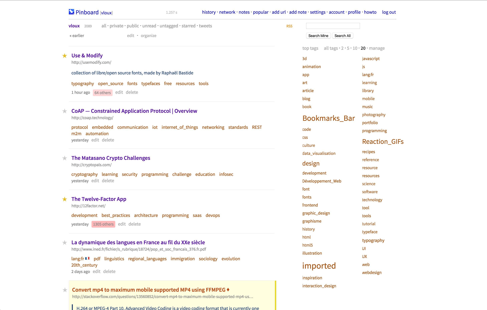

# Nicer Pinboard

This is an alternative stylesheet for [Pinboard](https://pinboard.in), which gives it a slightly more modern and usable look, while retaining the original simplicity that we all love.

- New font (Fira Sans, but you can set it to any other local font or webfont of your liking — if you own it, I highly recommend [National](https://klim.co.nz/retail-fonts/national/) by Klim Foundry.
- Larger spacing and subtle separating lines between links, which makes the list much clearer and easier to browse
- Private links are now in yellow, and to-read links have an indicator
- Fixes the missing margin under `<blockquote>`s in link descriptions (that’s particularly useful if you use Pinboard Plus, which blockquotes selected text)
- And a few other spacing enhancements (in the details and tags)

## Installation

You will need the Stylish plugin, which is available [for Chrome](https://chrome.google.com/webstore/detail/fjnbnpbmkenffdnngjfgmeleoegfcffe) and [for Firefox](https://addons.mozilla.org/en-US/firefox/addon/stylish/?src=external-userstyleshome). It’s like GreaseMonkey, but for CSS. This CSS should however work with similar extensions or methods if you are using another browser.

This will be published on UserStyles.org at some point, but for now you’ll have to install it manually:

- Navigate to [pinboard.in](https://pinboard.in).
- Click the Stylish icon in your toolbar, then *Manage installed styles*, then *Write new style*.
- Copy the contents of `pinboard.css` in the Code section, and **make sure** that in the “Applies to” section, you then specify “URLs on the domain: `pinboard.in`”.
- Input a name and save.

## Screenshot

## To do

- Fix some bugs with links colours
- Make unread links more distinctive
- Clean up the code
- Put on userstyles.org for easy installation
